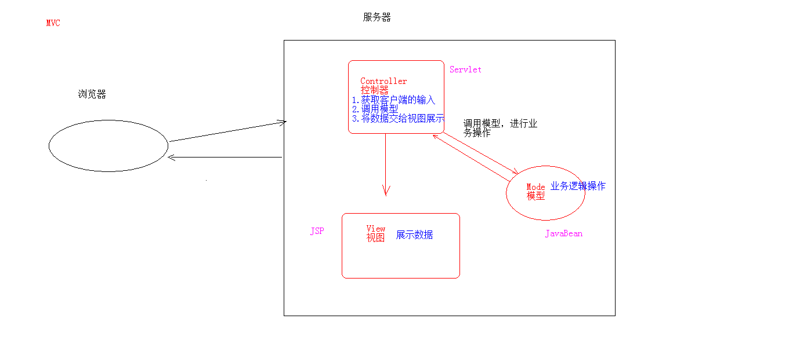

## 1. MVC开发模式

1. 早期只有servlet，只能使用response输出标签数据，非常麻烦
2. 后来有jsp，简化了servlet开发，但是在jsp中写大量的java代码，又写html代码，维护困难，难于分工协作
3. 最后借鉴mvc开发模式，使程序设计更加合理。

### 1.1 Model

模型，JavaBean，完成具体的业务操作

### 1.2 View

视图，JSP，用于展示数据

### 1.3 Controller

控制器，Servlet，

- 获取用户输入
- 调用模型
- 将数据交给视图进行展示



## 2 三层架构：软件设计架构

1. 界面层：用户看得见的界面，可以通过界面上的组件和服务器交互
2. 业务逻辑层：处理业务逻辑
3. 数据访问层：操纵数据存储文件


## 3. Filter

`Servlet/Filter/Listerner`是JavaWeb三大组件。其中监听器用于监听访问路径，如果访问路径满足监听条件，则

1. 执行过滤器
2. 执行放行后的资源
3. 回来执行过滤器放行代码下面的代码

```java
package top.gaogx.www.filter;

/*
  @author wangdh
  @date 2019-07-11 - 09:25  
*/


import javax.servlet.*;
import javax.servlet.annotation.WebFilter;
import java.io.IOException;

@WebFilter(urlPatterns = "/*")
public class FilterDemo implements Filter {

    public static void main(String[] args) {


    }

    @Override
    public void doFilter(ServletRequest servletRequest, ServletResponse servletResponse, FilterChain filterChain) throws IOException, ServletException {
        System.out.println("filter....");
        filterChain.doFilter(servletRequest, servletResponse);
        System.out.println("filter end....");
    }
}
```

### 3.1 方法：

1. init：服务器启动，创建Filter对象，调用init方法，只执行一次，用于加载资源
2. doFilter：每一次请求资源时，会执行，执行多次
3. destroy：服务器关闭，Filter对象销毁，执行destroy方法，只执行一次，用于释放资源

### 3.2 功能

用于完成通用的操作，如登录验证，统一编码处理，敏感字符处理等。

### 3.3 过滤器链

执行顺序：

- Filter1
- Filter2
- 资源执行
- Filter2
- Filter1

先后顺序如下：

1. 注解配置，按照类名的字符串比较规则比较，值小的先执行
2. web.xml配置：<filter-mapping>定义在前面的先执行

## 4. Lister

事件监听机制：

- 事件：一件事情
- 事件源：事件发生的地方
- 监听器：一个对象
- 注册监听：将事件、事件源、监听器绑定在一起，事件源发生某个时间之后，执行监听器代码
